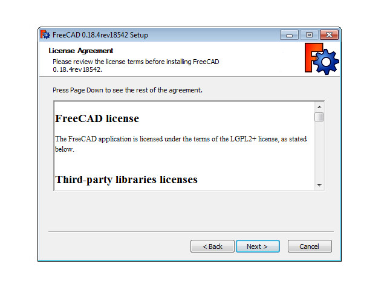
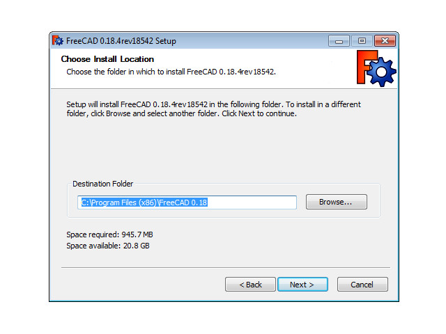
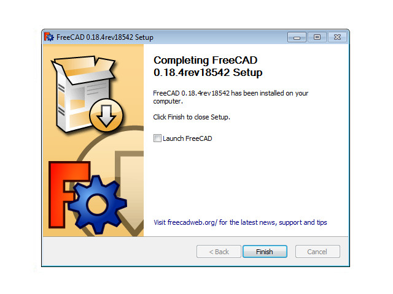
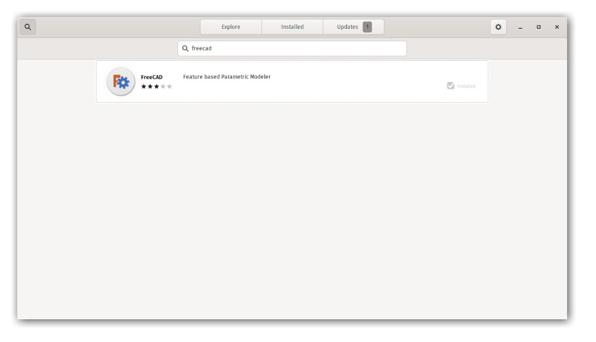
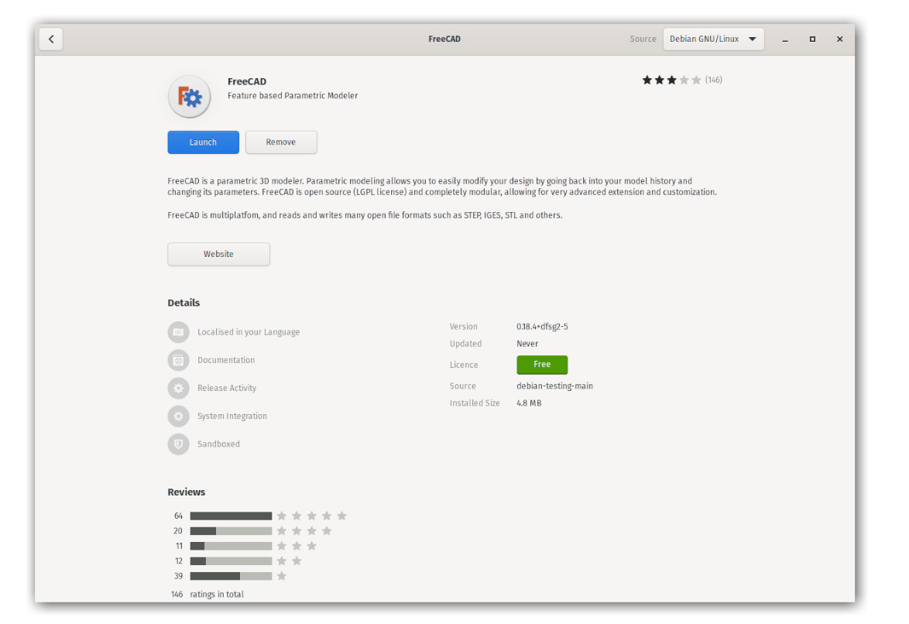
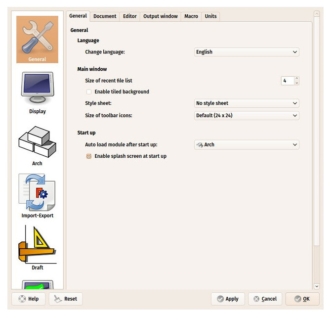
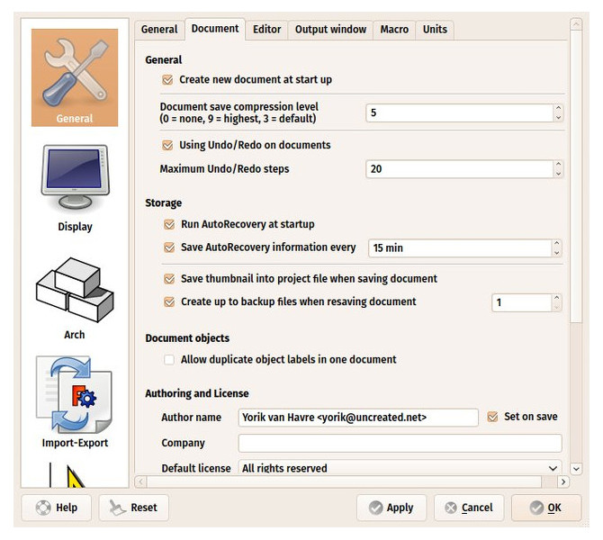
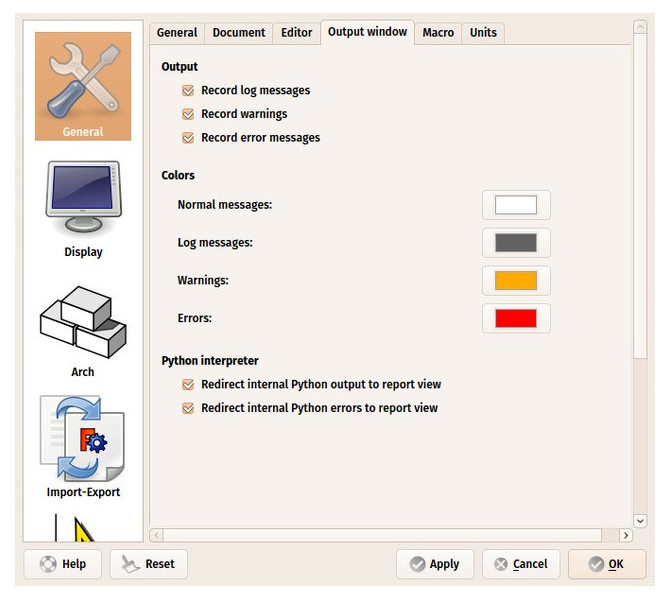
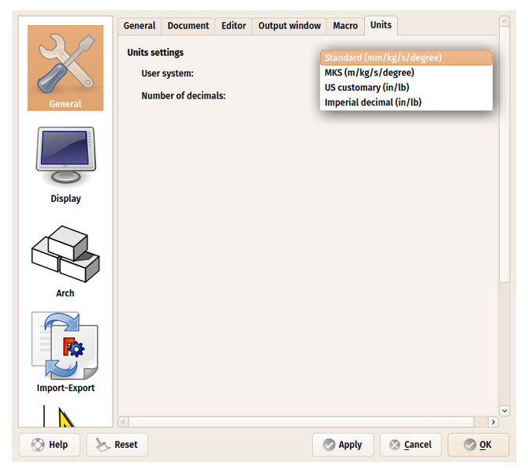
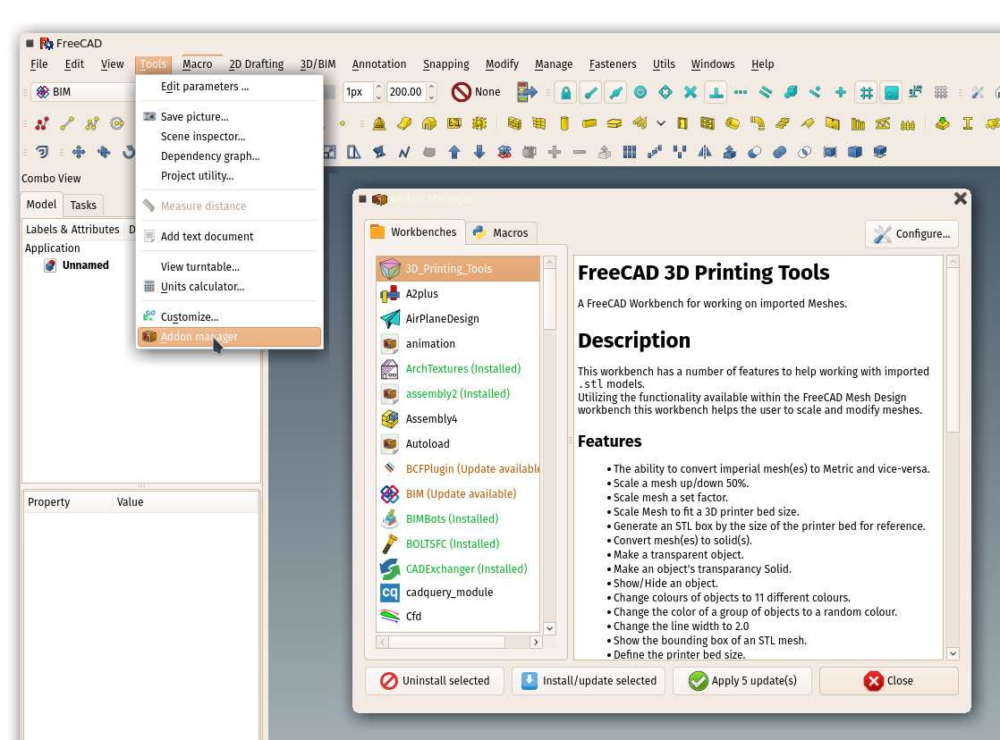

## Installing

FreeCAD uses the [LGPL license](https://en.wikipedia.org/wiki/GNU_Lesser_General_Public_License), which means you are free to download, install, redistribute and use FreeCAD the way you want, regardless of the type of work you'll do with it (commercial or non-commercial). You are not bound to any clause or restriction, and the files you produce with it are fully yours. The only thing that the license prohibits, really, is to claim that you programmed FreeCAD yourself!

FreeCAD runs without any difference on Windows, Mac OS and Linux. However, the ways to install it differ slightly depending on your platform. The FreeCAD community provides pre-compiled packages (installers) ready to download, for Linux, Windows and Mac. On Linux, the source code is also made available to Linux distributions maintainers, who are then responsible for packaging FreeCAD for their specific distribution. As a result, on Linux, you can usually install FreeCAD right from the software manager application.

The official FreeCAD download page for Windows, Mac OS and Linux packages is https://www.freecadweb.org/downloads.php

**FreeCAD versions**

The official releases of FreeCAD, on the page above or in your distribution's software manager, are stable versions (version **0.18** at the time of writing). However, the development of FreeCAD is fast! New features and bug fixes are added almost every single day. Since it can sometimes take a long time between stable releases, you might be interested in trying a more bleeding-edge version of FreeCAD. These development versions, or pre-releases (version **0.19** at the time of writing), are uploaded from time to time to the [FreeCAD releases repository](https://github.com/FreeCAD/FreeCAD/releases). If you are using Ubuntu, the FreeCAD community also maintains [PPA](https://launchpad.net/~freecad-maintainers/+archive/ubuntu/freecad-daily) (Personal Package Archives) or 'daily builds' which are regularly updated with the most recent changes.

Development versions are usually very stable, as they must pass a series of automatic tests before being published. Many FreeCAD users use a development version as their main work version. Unless you have a special reason to use a stable version (for example you must provide support for it, or redistribute it to your clients), you are highly advised to try a development version, as you will benefit from all the latest improvements and fixes.

If you are installing FreeCAD in a virtual machine, please be aware that the performance might be low, or in some cases unusable due to the limits of [OpenGL](https://en.wikipedia.org/wiki/OpenGL) support on most virtual machines.

### Installing on Windows

1. Download a Windows installer package (.exe) corresponding to your version of Windows (32bit or 64bit) from  the [download page](https://www.freecadweb.org/downloads.php). The FreeCAD installers should work on any windows version starting from Windows 7.
2. Double-click the downloaded installer.
3. Accept the terms of the LGPL license (this will be one of the few cases where you can really, safely click the "accept" button without reading the text. No hidden clauses):

4. You can leave the default path here, or change if you wish:
  
7. Wait for the install process to complete, and that's it, FreeCAD is installed. You will find it in your start menu.

**Installing a development version**

Packaging FreeCAD and creating an installer takes some time and dedication, so usually, development (also called pre-release) versions are provided as .zip or [.7z](https://www.7-zip.org/) archives. These don't need to be installed, just unpack them and launch FreeCAD by double-clicking the FreeCAD.exe file that you will find inside. This also allows you to keep both the stable and "unstable" versions together on the same computer.

### Installing on Linux

On most modern Linux distributions (Ubuntu, Fedora, OpenSUSE, Debian, Mint, Elementary, etc), FreeCAD can be installed with the click of a button, directly from the software management application provided by your distribution (the aspect of it can differ from the images below, each distribution uses its own tool).

1. Open the software manager and search for "freecad":

2. Click the "install" button and that's it, FreeCAD gets installed. Don't forget to rate it afterwards!

**Alternative ways**

One of the big joys of using Linux is the multitude of possibilities to tailor your software, so don't restrain yourself. On Ubuntu and derivatives, FreeCAD can also be installed from a [PPA](https://launchpad.net/~freecad-maintainers) maintained by the FreeCAD community (it contains both stable and development versions) and since this is open-source software, you can also easily [compile FreeCAD yourself](http://www.freecadweb.org/wiki/index.php?title=Compiling).

### Installing on  Mac OS

Installing FreeCAD on Mac OSX is nowadays as easy as on other platforms. However, since there are less people in the community who own a Mac, the available packages often lag a couple of versions behind the other platforms.

1. Download a zipped package corresponding to your version from  the [download page](https://github.com/FreeCAD/FreeCAD/releases).
2. Open the Downloads folder, and expand the downloaded zip file:

3. Drag the FreeCAD application from inside the zip to the Applications folder:

4. That's it, FreeCAD is installed!

5. If the system prevents FreeCAD to launch, due to restricted permissions for applications not coming from the App store, you will need to enable it in the system settings:

### Uninstalling

Hopefully you won't want to do that, but it is good to know anyway. On Windows and Linux, uninstalling FreeCAD is very straightforward. Use the standard "remove software" option found in the control panel on Windows, or remove it with the same software manager you used to install FreeCAD on Linux. On Mac, all you need to do is remove it from the Applications folder.

### Setting basic preferences

Once FreeCAD is installed, you might want to open it and set a couple of preferences. Preferences settings in FreeCAD are located under menu **Edit -> Preferences**. You can browse through the different pages to see if there is anything else you would want to change, but here are a couple of basic ones:

1. **Language**: FreeCAD will automatically pick the language of your operating system, but you might want to change that. FreeCAD is fully translated into 8 or 9 languages, plus many others for which the translation is not complete yet. You can easily make that better, by [helping to translate FreeCAD](https://crowdin.com/project/freecad).

2. **Auto-load module**: Normally, FreeCAD will start showing you the [start center](https://wiki.freecadweb.org/Start_Workbench). But you can skip this and begin a FreeCAD session directly in the workbench of your choice. [Workbenches](http://www.freecadweb.org/wiki/index.php?title=Workbenches) will be explained in detail in the [next chapter](the_freecad_interface.md).
3. **Create document at startup**: Combined with the option above, this starts FreeCAD ready for work.

4. **Storage options**: As any complex application, FreeCAD might crash from time to time. Here you can configure a few options that will help you to recover your work in case of a crash.
5. **Authoring and license**: FreeCAD files can contain an author name, and a license. You can set default values there, and you might also like to make your files shareable right from the start, by using a friendlier, [copyleft](https://en.wikipedia.org/wiki/Copyleft) license like [Creative Commons](https://creativecommons.org/).
6. **Redirect python messages to output view**: These two options are always good to mark, as they will permit you to see what's wrong in the Report View when there's a problem with running a particular python script.

7. **Units**: Here you can set the default units you wish to see measurements in.  This only affects the display, as FreeCAD always works in real-world units. You can change this anytime, without modifying the model.

### Installing additional content

As the FreeCAD project and its community grows quickly, and also because it is easy to extend, external contributions and side-projects made by community members and other enthusiasts begin to appear everywhere on the internet. The [FreeCAD addons project](https://github.com/FreeCAD-addons) is a collective effort to gather all these external projects developed outside the main FreeCAD project.

There, among other things, you will find:

1. A [Parts library](https://github.com/FreeCAD/FreeCAD-library), which contains all kinds of useful models, or pieces of models, created by FreeCAD users that can be freely used in your projects. The library can be used and accessed right from inside your FreeCAD installation via a macro.
2. A [collection of additional workbenches](https://github.com/FreeCAD/FreeCAD-addons), most of them additional workbenches, that extend the functionality of FreeCAD for certain tasks. Instructions for installing are given on each separate addon page.
3. A [collection of macros](https://github.com/FreeCAD/FreeCAD-macros), which are also available [on the FreeCAD wiki](http://www.freecadweb.org/wiki/index.php?title=Macros_recipes) along with documentation about how to use them.

All the content above can be viewed and installed directly from withing FreeCAD, using the [Addons Manager](https://wiki.freecadweb.org/Std_AddonMgr), found under menu **Tools -> Addons Manager**

The addons manager allows you to very simply install, uninstall and update any external workbench or macro. Be sure to read the descriptions before installing!

-----

**Read more**

* More download options: http://wiki.freecadweb.org/Download
* Detailed installation instructions: http://wiki.freecadweb.org/Installing
* FreeCAD PPA for Ubuntu: https://launchpad.net/~freecad-maintainers
* Compile FreeCAD yourself: http://wiki.freecadweb.org/Compiling
* FreeCAD translations: https://crowdin.com/project/freecad
* FreeCAD github page: https://github.com/FreeCAD
* The FreeCAD addons manager: https://wiki.freecadweb.org/Std_AddonMgr
