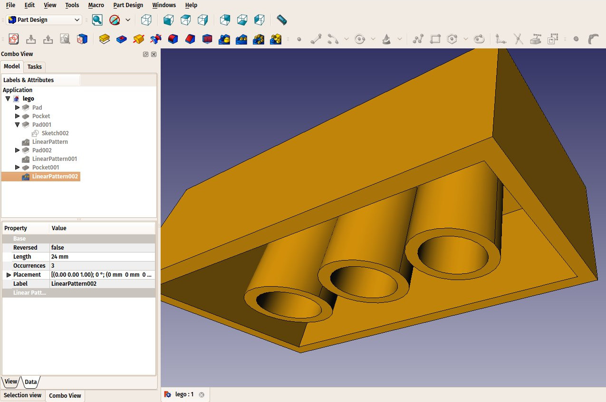
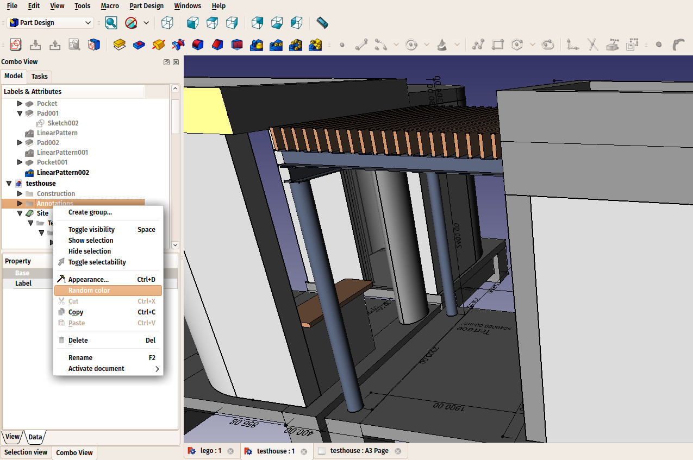

## The FreeCAD document

A FreeCAD document contains all the objects of your scene. It can contain groups and objects made with any workbench. You can switch between workbenches, and still work on the same document and/or objects within that document. The document is what gets saved to disk when you save your work. You can also open several documents at the same time in FreeCAD, and open several views of the same document.

Inside the document, the objects can be moved into [groups](https://wiki.freecadweb.org/Std_Group), and have a unique name. Managing groups, objects and object names is done mainly from the **Tree view**. There, you can create groups, move objects to groups, delete objects or groups. By right-clicking in the tree view or on an object, you can rename objects, change their color, hide or show them, or possibly other operations, depending on the current workbench.

The objects inside a FreeCAD document can be of different types. Each workbench can add its own types of objects, for example the [Mesh Workbench](http://www.freecadweb.org/wiki/index.php?title=Mesh_Module) adds mesh objects, the [Part Workbench](http://www.freecadweb.org/wiki/index.php?title=Part_Module) adds Part objects, etc.

There is always only one active document at a time. That's the document that appears in the current 3D view, the document you are currently working on. If you switch tabs to another document, that one becomes the active document. Most operations always work on the active document.

Objects always live in one specific document, but objects from other documents can be linked into the current document using [Link](https://wiki.freecadweb.org/App_Link) objects.

FreeCAD documents are saved with the **.FCStd** extension, which is a zip-based compound format, similar to [LibreOffice](https://www.libreoffice.org). If something goes very wrong, it is often possible to unzip it and fix the problem or rescue the data.

-----

**Read more**

* The FreeCAD document: http://wiki.freecadweb.org/Document_structure
* The FCStd file format: http://wiki.freecadweb.org/File_Format_FCStd
* Groups: https://wiki.freecadweb.org/Std_Group
* Link objects: https://wiki.freecadweb.org/App_Link

