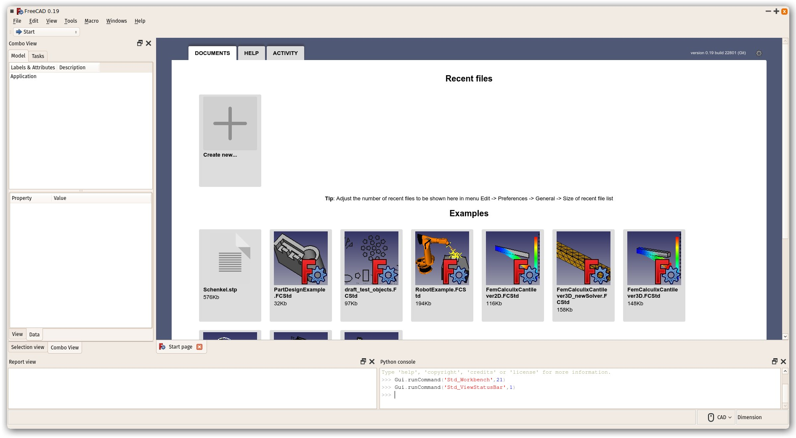
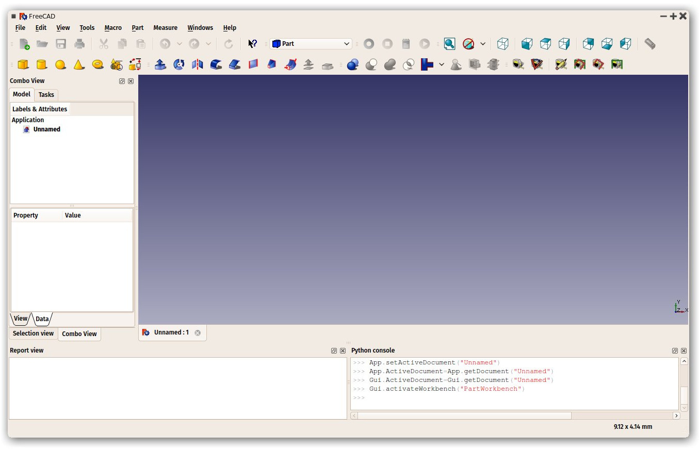
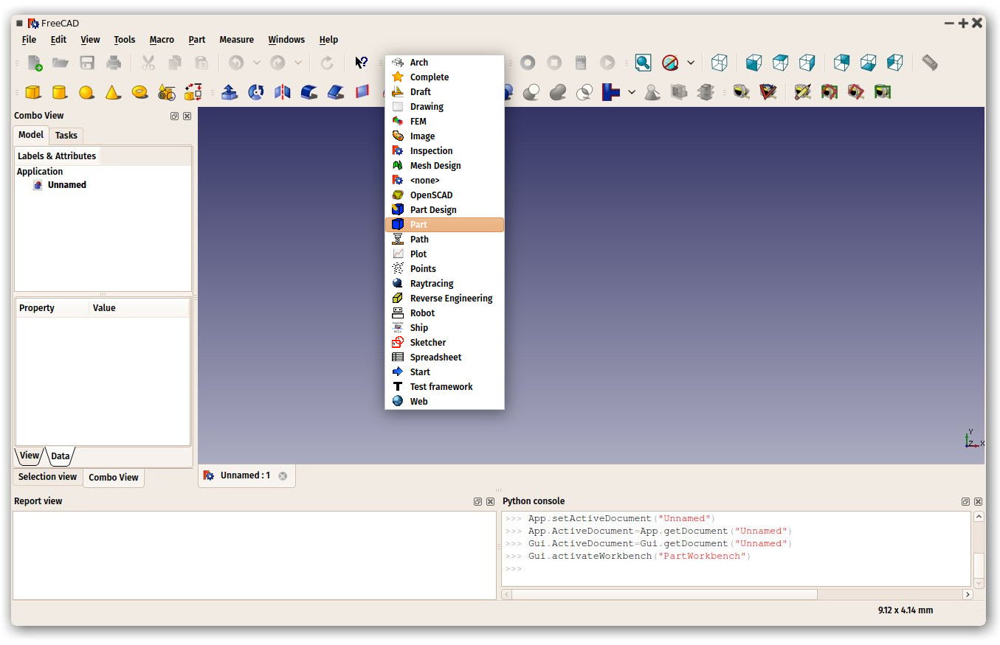
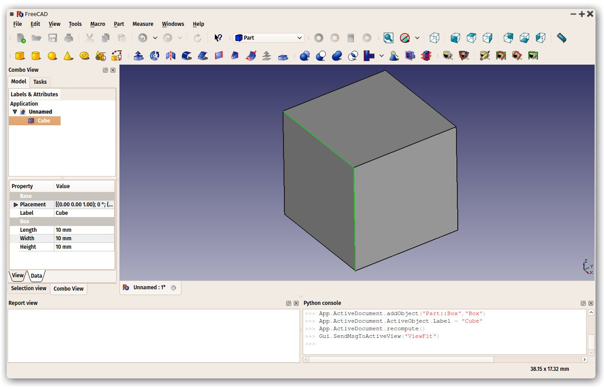
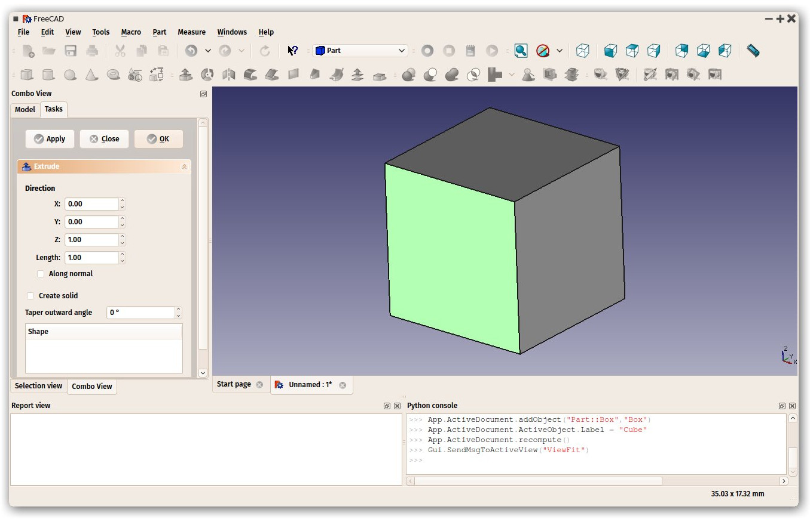
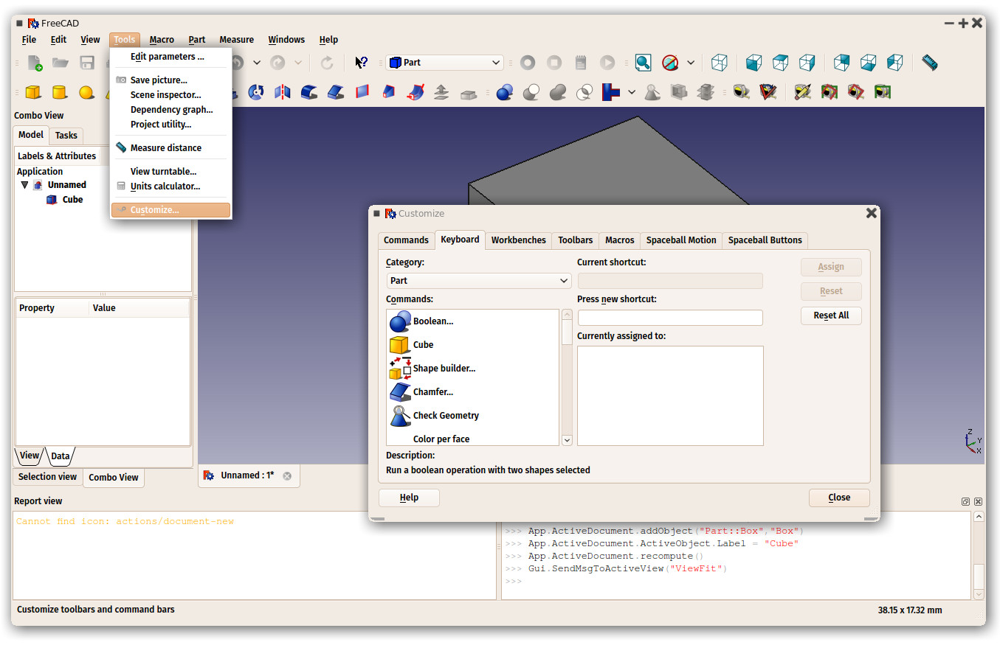

## The FreeCAD interface

FreeCAD uses the [Qt framework](https://en.wikipedia.org/wiki/Qt_(software)) to draw and manage its interface. This framework is used in a wide range of applications. The FreeCAD interface is pretty classical and presents no particular difficulty to understand. Most buttons are standard and will be found where you expect them (File -> Open, Edit -> Paste, etc). Here is the look of FreeCAD when you open it for the first time, just after installing, showing you the [start page](https://wiki.freecadweb.org/Start_Workbench):

The start page is a convenient "welcome screen", that shows useful information like the latest files you have been working with, some general information like how to get help, and the latest activity on and around the FreeCAD code. It will also notify you if a new stable version of FreeCAD is available. Next to the version number, a cog icon allows you to customize the start page.

Close the Start Page tab (click on the tab x near the bottom) and create a new document (Ctrl-N):

### Workbenches

Note that some of the icons have changed between the two screenshots above. This is where the most important concept used in the FreeCAD interface comes into play: **Workbenches**. 

Workbenches are group of tools (toolbar buttons, menus, and other interface controls) that are grouped together by speciality. Think of a workshop  where you have different people working together: A person who works with metal, another with wood. Each of them has, in their workshop, a separate table with specific tools for his/her job. However, they can all work on the same objects. The same happens in FreeCAD.

The most important control of the FreeCAD interface is the workbench selector, which you use to switch from one workbench to another:

Workbenches often confuse new users, since it's not always easy to know in which workbench to look for a specific tool. But they are quick to learn, and after a short while, they will feel natural. Workbenches are a convenient way to organize the multitude of tools FreeCAD has to offer.  In addition, Workbenches are also fully customizable (see below).

Later in this manual, you will find a table showing the most common workbenches and the tools they contain.

### The interface

Let's have a better look at the different parts of the interface:

* **The 3D view** is the main component of the interface. It can be undocked out of the main window, you can have several views of the same document (or same objects), or several documents opened at the same time. You can select objects or parts of objects by clicking them, and you can pan, zoom and rotate the view with the mouse buttons. Navigating in the 3D view will be explained further in the next chapter.
* **The combo view** on the left side of the window, has one above panel with two tabs and one bottom panel: 
	* The **Model** tab shows you the contents and structure of your document (see above) and the properties (or parameters) of the selected object(s) (see below.) These Model Tab properties are separated in two categories: 
		* Data (properties which concern the geometry itself)
		* View (properties that affect how the geometry looks like on screen). 
	* The **Tasks** tab is where FreeCAD will prompt you for values specific to the tool you're currently using at the time—for example, entering a 'length' value when the Line tool is being used. It will close automatically after pressing the OK (or Cancel) button. Also, by double-clicking the related object in the combo view, most tools will allow you to reopen that task panel in order to modify the settings. 
	* The **properties view** panel shows the properties of selected objects, and allows you to change the values of these properties. If more than one object is selected, only the properties they have in common are displayed. When you give a new value to a property, this will affect all selected objects.
* **The report view** is usually kept hidden, but you might need to open it sometimes, as it will list any information, warnings or errors to help you decipher (or debug) what you may have done wrong.  Turn it on/off under *View menu -> Panels -> Report View*.
* **The Python console** is where you can interact with the contents of the document using the [Python language](https://en.wikipedia.org/wiki/Python_%28programming_language%29). Since every action you do on the FreeCAD interface actually executes a piece of Python code, having this open allows you to watch the code unfold in real time—allowing you a wonderful and easy way to learn a little Python on the way, almost without noticing it.  Turn it on/off under *View menu -> Panels -> Python Console*.

Any of the panels or toolbars onthe FreeCAD interface can be turned on/off from menu *View -> Panels* or *View -> Toolbars*.

### Customizing the interface

The interface of FreeCAD is deeply customizable. All panels and toolbars can be moved to different places or stacked one with another. They can also be closed and reopened when needed from the View menu or by right-clicking on an empty area of the interface. There are, however, many more options available, such as creating custom toolbars with tools from any of the workbenches, or assigning and changing keyboard shortcuts.

These advanced customization options are available from the *Tools -> Customize* menu:

The FreeCAD interface also offers several themes (inteface colors and icons). The theme can be changed under menu *Edit -> Preferences -> General -> Stylesheet*.

-----

**Read more**

* Getting started with FreeCAD: http://wiki.freecadweb.org/Getting_started
* Customizing the interface: http://wiki.freecadweb.org/Interface_Customization
* Workbenches: http://wiki.freecadweb.org/Workbenches
* More about Python: https://www.python.org
